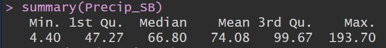
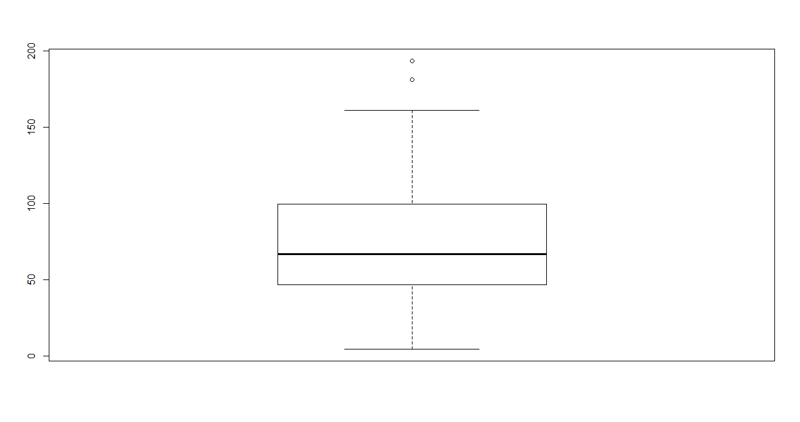

Time Series Analysis 
Author: Shaarang Buckal

Background
Using time series analysis, we shall attempt to predict the precipitation in Waterloo for five years beyond the known timeline.
Data Source
The Data is retrieved from Environment Canada, the data is authentic and clean. 
Data Transformation and Cleaning (Description)

Descriptive Data Analysis – WellandRain

 There is nothing out of the ordinary in the summary for precipitation. The precipitation data is approximately symmetrical
 
 
 
 #### The boxplot for precipitation data shows two prominently separate datapoints but I would not classify them as outliers.
