# Time Series Analysis 
# Author: Shaarang Buckal

# Background
Using time series analysis, we shall attempt to predict the precipitation in Waterloo for five years beyond the known timeline.
Data Source
The Data is retrieved from Environment Canada, the data is authentic and clean. 

# Descriptive Data Analysis – WellandRain

 There is nothing out of the ordinary in the summary for precipitation. The precipitation data is approximately symmetrical
 
 
 
 #### The boxplot for precipitation data shows two prominently separate datapoints but I would not classify them as outliers.

 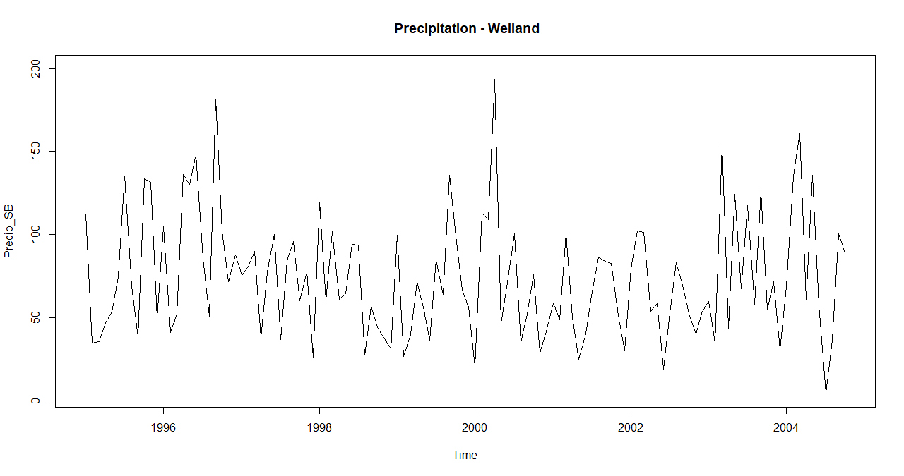
 
 The precipitation significantly changed in 2000, the precipitation was its lowest in the timeline after 2004.
 
  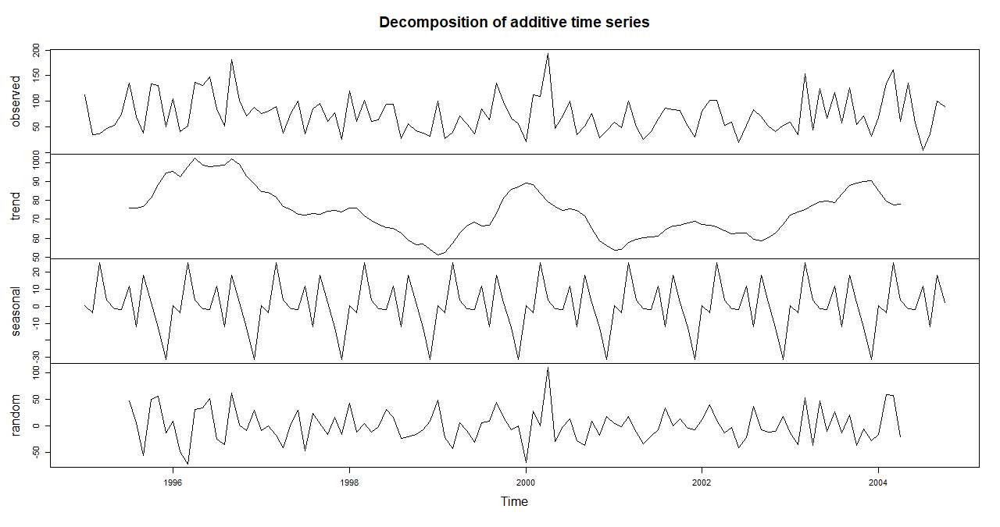
  
  The trend component is decreasing from a global maxima (which is obvious),  it then increases gradually. Overall the trend is neither strictly increasing nor strictly decreasing. The seasonal component as expected is a repetitive pattern. The random component can not be deduced visibly, it appears to be purely random.
  
  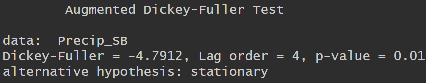
  
  '''The time series is stationary, evident from the low p-value.'''
  # DE seasonalized precipitation
  
   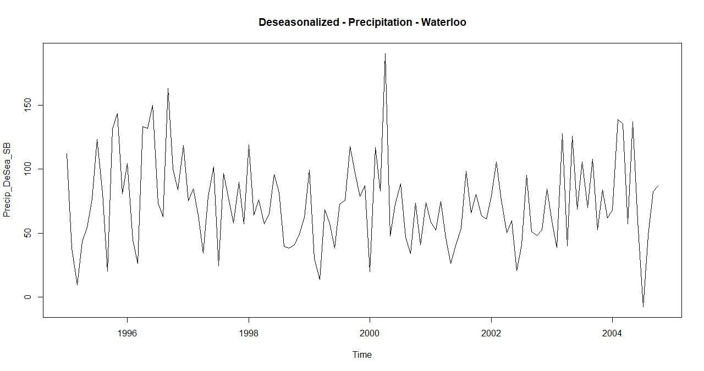
   
   All I see is data that is consistently stuck in a loop of data increment and decrement
   
   # Waterloo Precipitation
   
   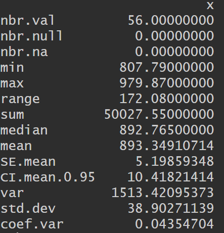
   
   The annual precipitation for Waterloo is symmetrically distributed between the min and max values
   
   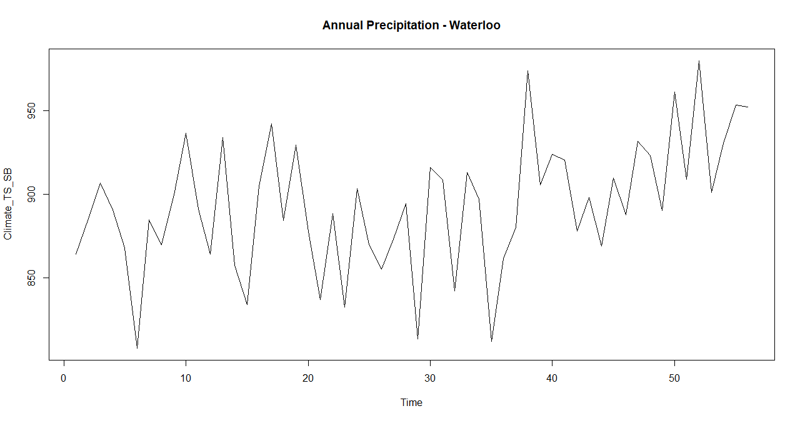
   
   No visible pattern, the plot is exactly what I would expect for a standard time series data

After comparison I deduced a window of size 3 produced the best graph representing the pattern in the original Annual Precipitation times series plot.

 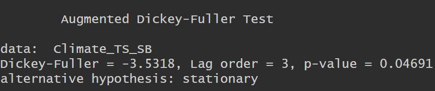

The time series is stationary as evident by the p-value.

 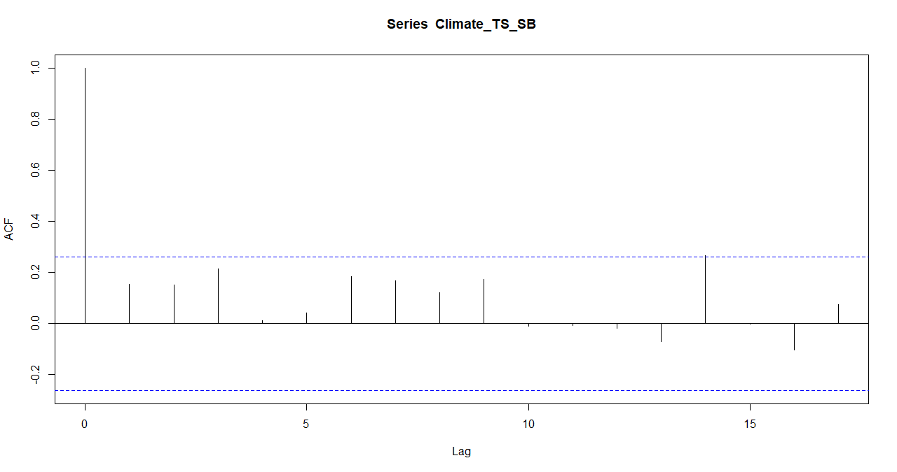
 
 The autocorrelation chart displays that the recent values influenced only for data points with a lag of 14, data points with other lags could not SIGNIFICANTLY influence the current values. Any lag above the blue dotted line potentially influence the current values. We can see now lag bar crosses the threshold only lag of 14 matches the threshold
 
 # SMA Forecast:
 
 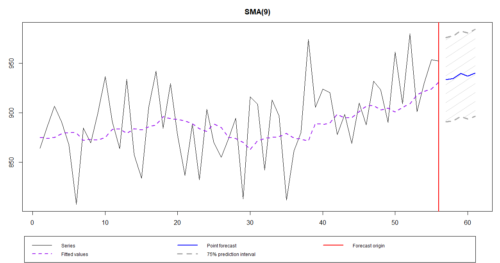
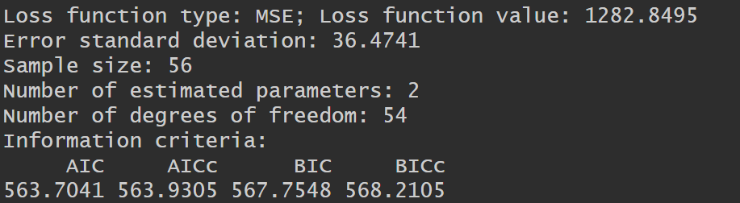

# Exponentially Smoothed Forecast

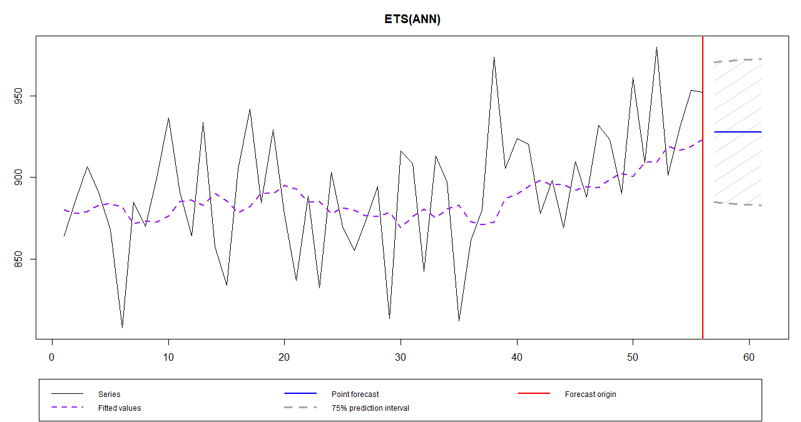

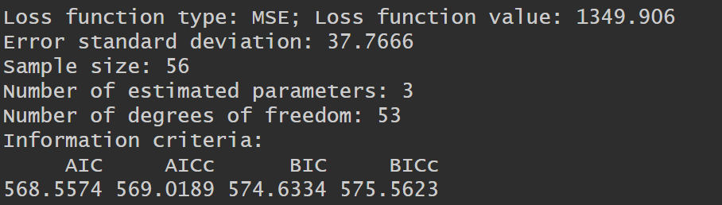
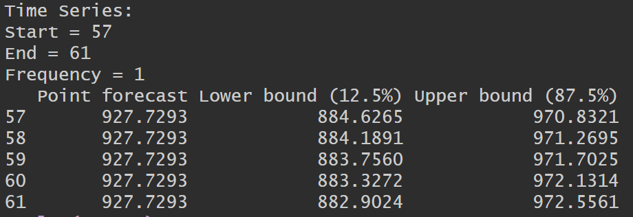

The Loss function value for SMA is lower than the Loss function value for Exponential Smoothing. Also, the SMA curve better represents the overall data increase or decrease pattern in the local regions. Even the AIC for SMA is lower, so the SMA forecast is superior. 
